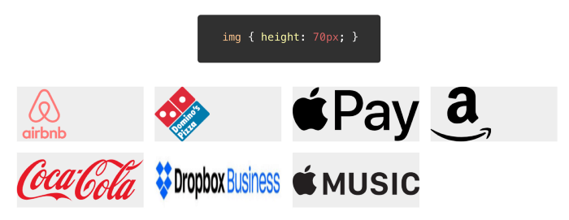
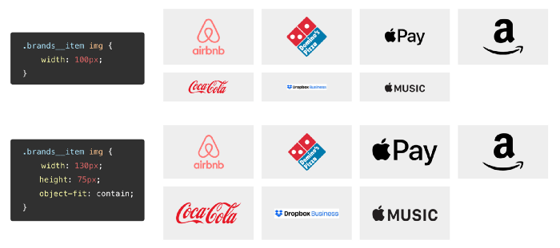

Bir frontend geliştirici olarak, kişisel sitenizin portfolyo sayfasında müşterilerinizin logolarını listelediğiniz bir bölüm oluşturmuş olabilirsiniz. Kolay gibi görünse de, logoların hizalama ve ortalama ile ilgili bazı zorlukları beraberinde getirir; logoların farklı boyutlarda olması bir yana, yatay ve dikey olmaları sağlıklı bir çıktıya ulaşmanızı zorlayabilir.

Bu makalede, farklı boyut ve şekillerdeki logoları CSS ile göze hoş şekilde nasıl hizalayacağımızı göreceğiz.

Birbirinden farklı 8 farklı logo; dikey/yatay, büyük/küçük.


Öncelikle bu logoları CSS Grid layout'u kullanarak hizalamaya başlayalım.

```html
<ul class="brands">
  <li class="brands__item">
    <a href="#">
      
    </a>
  </li>
  <li> <!-- diğer logolar --> </li>
</ul>
```

```css
.brands {
  display: grid;
  grid-gap: 1rem;
  grid-template-columns: repeat(auto-fit, minmax(150px, 1fr));
}

.brands__item {
  background: #eee;
}

.brands__item img {
  display: block;
  max-width: 100%;
}
```

Bu işlemler sonucunda görüldüğü gibi her logonun birbirine eş alanları oldu ve bu alanın tamamını kapsıyorlar.


Logo boyutları tutarlı değil. İlk çözüm olarak `width` ekleyerek hepsine sabit genişlik vermeyi deneyelim.

```css
.brands__item img {
  display: block;
  max-width: 100%;
  width: 100px;
}
```


Bu işlem sonucunda logolar sabit genişliğe geçti fakat bu istediğimiz bir sonuç değil. Bazı logolar okunamayacak derecede küçük kaldı.

`width` kodunu kaldırıp daha düzgün bir sonuç almak adına sabit bir `height` kodunu deneyelim.

```css
.brands__item img {
  display: block;
  height: 70px;
  max-width: 100%;
}
```



Bu seferde yükseklikleri eşit oldu fakat esnemelerden ötürü her logodan istediğimiz sonucu alamadık.

En sağlıklı yol, `width` ve `height` birlikte kullanmak gibi duruyor. Logoların esneme problemini `object-fit` kullanarak çözebiliriz.

```css
.brands__item img {
  height: 75px;
  object-fit: contain;
  width: 130px;
}
```

Sonraki adım, logoları yatay ve dikey olarak ortalamak; Bunun için `flex` kullanacağım.

```css
.brands__item a {
  align-items: center;
  display: flex;
  height: 100%;
  justify-content: center;
}
```



Sonuç olarak farklı boyut ve çeşitlerde logolarımızda olsa bunları net görünür şekilde listelemeyi başardık.

## Beyaz Arkaplanı Kaldırmak İçin CSS mix-blend-mode Kullanma

Bazı logoların JPG formatında ve arkalarında beyaz bir zemin renginin olduğunda, logonun şeffaf haline erişemiyorsanız ` mix-blend-mode` kullanarak görselin arkaplan ile karışmasına izin verebilirsiniz.


`mix-blend-mode` kullanmak, logoyu arkaplan rengiyle harmanlayacağı için bazı logolarınızın renklerinde değişiklikler farkedebilirsiniz.

Bu problemi ortadan kaldırmak için CSS seçicimizde görsellerin uzantılarına göre filtreleme yapabiliriz. PNG logoların bundan etkilenmemesi için CSS kodumuzu şu şekilde güncelleyebiliriz; Bu kod yalnızca uzantısı JPG olan görsellerin arkaplan ile karışmasına izin verecektir.


```css
.brands__item img[src$='.jpg'] {
  mix-blend-mode: multiply;
}
```