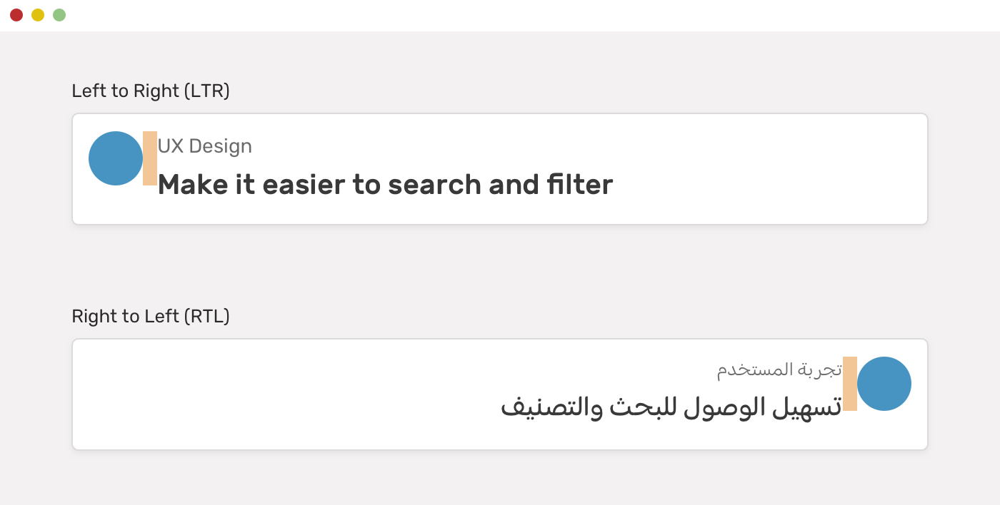
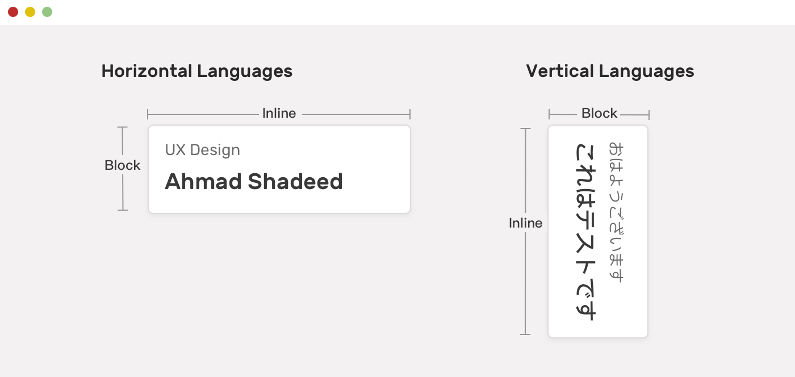

Web site geliştirirken varsayılan olarak yazı dilimiz soldan sağa (*Left to Right - LTR*) kullanıyoruz. Arapça gibi sağdan sola doğru okuma yönü olan diller için site geliştiriyorsak, `<html>` etiketinize `dir` özelliği ekleyerek yazı dilinin sağdan sola olacağını belirtmelisiniz (`<html dir="rtl">`).

CSS mantıklar özelliklerin temel fikri, CSS özelliklerinde fiziksel yönleri kullanmayacak olmamızdır. Bunun yerine HTML belgesinin yazım yönüne bağlı olan özellikleri kullanacağız. Bu özelliklere mantıksal özellik deniyor ve tarayıcı desteği oldukça iyi (<a href="https://caniuse.com/css-logical-props" target="_blank" rel="noreferrer noopener">tarayıcıların CSS Logical Properties desteği</a>). 


## Mantıksal Özellikler Olmadan Önce

Basit bir tasarımla neyi kastettiğimizi daha iyi anlayalım. Aşağıdaki görseli koda dökerken, ilk olarak avatarın sağına boşluk vermek gerekecekti; eğer yazı dili sağdan sola ise bu boşluğu soldan vermeliydik.



```css
.avatar {
  margin-right: 16px;
}

html[dir="rtl"] .avatar {
  margin-right: 0;
  margin-left: 16px;
}
```

Görüldüğü gibi çok dilli bir sitede sadece avatar ile yazı arasına boşluk verebilmek için bile çok kod yazmak zorunda kaldık. Bunu tüm projede her yere uyguladığınızı düşünün... İşte CSS'in mantıktal özellikleri burada yardımımıza koşuyor. Aynı işi `margin-inline-end` ile tek satırda yapabiliriz.

```css
.avatar {
  margin-inline-end: 16px;
}
```

Bu kod, HTML belgesinin yönüne bağlı olarak farklı şekilde çalışacaktır.

## Inline - Block - Start - End

`margin` ve `padding`te alışık olduğumuzun dışında `inline` yada `block` özelliğiyle devam edip `start` veya `end` ekleyeceğiz. Peki bunlar ne anlama geliyor?

Türkçe, İngilizce, Arapça gibi diller yatay boyuttur; yani soldan sağa yada sağdan sola yazılırlar. Fakat Japonca ise yukarıdan aşağı yazılır, yani dikey boyuttur. `inline` yazının okunma yönünü belirtir.



`start` ve `end` ise okunma yönüne göre yazının başını yada sonunu belirtir.

Örnek olarak aşağıdaki görselde avatar ile yazının arasına aralık vermek istediğimizde `margin-inline-end` kodu işimizi görecektir. Türkçe, İngilizce gibi dillerde yazı soldan sağa okunduğu için `end` kodu sağdan manasına gelecektir ve avatarın sağına boşluk verecektir; yani `inline-end` burada `margin-right` işlevi görecektir. Arapça gibi okuma yönünün sağdan sola olduğu dillerde ise `end` kodu soldan manasına gelecektir ve avatarın soluna boşluk verecektir; yani `inline-end` burada `margin-left` işlevi görecektir.


## Mantıksal Olarak Hangi Özellikleri Kullanabiliriz?

Liste oldukça geniş, fakat genel olarak `border`, `margin`, `padding` ve `text-align` diyebiliriz. Tüm listeye <a href="https://developer.mozilla.org/en-US/docs/Web/CSS/CSS_Logical_Properties#reference" target="_blank" rel="noreferrer noopener">developer mozilla sitesinden</a> ulaşabilirsiniz.

Örnek olması açısından mantıksal özelliklerin olmadığı ve olduğu iki kodu inceleyelim.

```css
.card {
  padding-left: 2.5rem;
  padding-right: 1rem;
  border-left: 6px solid blue;
}

.card__icon {
  margin-right: 1rem;
}

html[dir="rtl"] .card {
  //Yazı dili sağdan sola ise bu kodlar çalışacak

  padding-right: 2.5rem;
  padding-left: 1rem;
  
  //Önceki kodu sıfırlamamız gerekiyor
  border-left: 0;
  border-right: 6px solid blue;
}

html[dir="rtl"] .card__icon {
  margin-right: 1rem;
}
```

Aynı kodu CSS mantıksal özellikleri ile şu şekilde yapabilirdik;

* `html[dir="rtl"]` kontrolü yok
* Önceki kodu sıfırlamak yok
* Fazladan CSS satırları yok...

```css
.card {
  padding-inline-start: 2.5rem;
  padding-inline-end: 1rem;
  border-inline-start: 6px solid blue;
}

.card__icon {
  margin-inline-end: 1rem;
}
```

### Metin Hizalama

Satırın okunma yönüne göre sonuna bir not yazmak istemizi düşünelim. Normalde bunu `text-align: right` ile yapıp, Arapça için `text-align: left` yazmamız gerekiyordu. Mantıksal özellikler ile her ikisini birden sadece `text-align: end` yardımıyla çözebilirdik.

### Kaynaklar

- <a href="https://ishadeed.com/article/css-logical-properties/" target="_blank" rel="noreferrer noopener">Ahmad Shadeed - Css Logical Properties</a>
- <a href="https://caniuse.com/css-logical-props" target="_blank" rel="noreferrer noopener">caniuse.com/css-logical-props</a>
- <a href="https://developer.mozilla.org/en-US/docs/Web/CSS/CSS_Logical_Properties#reference" target="_blank" rel="noreferrer noopener">developer.mozilla.org</a>